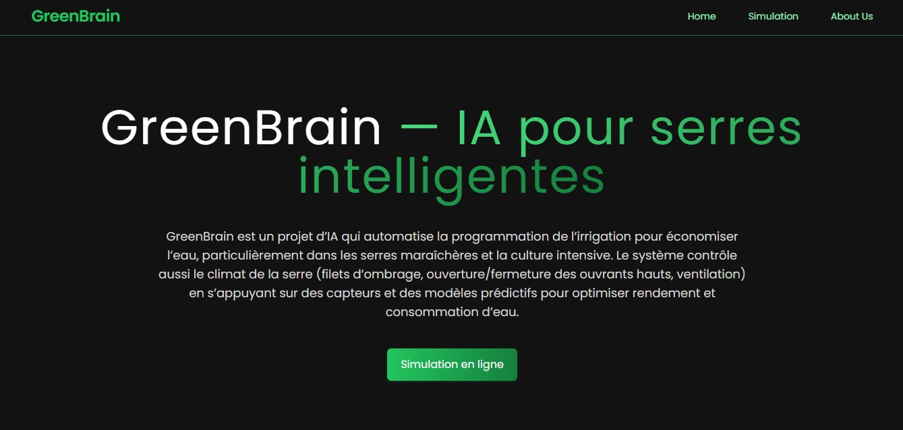

# 🧠 GreenBrain - IA pour Serres Intelligentes


GreenBrain est un projet de démonstration full-stack utilisant l'intelligence artificielle pour optimiser la gestion des serres. Il prédit les actions de contrôle climatique (aération, ombrage), gère l'irrigation et recommande les cultures adaptées en fonction des données environnementales.

---

## 🚀 Vidéo de Démonstration

Cliquez ci-dessous pour voir une démonstration complète de l'application (assurez-vous que l'image `frontend/src/assets/demo.jpeg` est dans votre dépôt).

[](https://drive.google.com/file/d/1n_hN8LiSlGXSyY_qwBq9eMoI7znhOY_I/view?usp=drive_link)

**[Lien direct vers la vidéo de démonstration](https://drive.google.com/file/d/1n_hN8LiSlGXSyY_qwBq9eMoI7znhOY_I/view?usp=drive_link)**

---

## 🌟 Fonctionnalités principales

* **Contrôle Climatique (IA)**: Prédit l'ouverture des ouvrants (`decision_vents`) et l'activation de l'ombrage (`decision_ombrage`) en fonction de la température, de l'humidité et de la lumière (PARin).
* **Gestion de l'Irrigation (IA)**: Prédit le volume d'eau nécessaire (`decision_volume_eau`) en fonction de l'humidité du sol et de la température.
* **Recommandation de Culture (IA)**: Suggère la culture la plus adaptée (parmi 22 types) en fonction de 7 facteurs du sol et de l'environnement (N, P, K, température, humidité, pH, pluviométrie).
* **Tableau de Bord Analytique**: Visualise l'historique simulé de l'humidité du sol et des événements d'irrigation, avec graphiques générés dynamiquement (via Matplotlib/Seaborn).
* **Simulation Simplifiée**: Fournit des créneaux d'arrosage (en minutes) basés sur le type de culture et de sol.
* **Frontend Reactif**: Interface utilisateur moderne construite avec React, Vite et Tailwind CSS, incluant la navigation (React Router) et la consommation d'API (Axios).

---

## 🛠️ Stack Technique

| Domaine | Technologies utilisées |
| :--- | :--- |
| **Backend** | Python, Flask, scikit-learn, Pandas, NumPy, Joblib, Matplotlib, Seaborn |
| **Frontend** | React (v19), Vite, Tailwind CSS, React Router, Axios, Lucide Icons |
| **Simulation 2D** | Pygame (Script séparé) |
| **Linting (FE)** | ESLint |

---

## ⚙️ Installation et Lancement Local

Pour exécuter ce projet, vous devez lancer le **backend** (Flask) et le **frontend** (React) dans deux terminaux distincts.

### 1. Backend (Serveur Flask)

Le backend sert l'API et les modèles de Machine Learning.

**a. Préparation et environnement virtuel**
```bash
# Clonez le dépôt (si ce n'est pas fait)
git clone <votre-lien-repo>
cd <votre-repo>/backend

# Créez un environnement virtuel
python -m venv venv

# Activez l'environnement
# Sur Windows
venv\Scripts\activate
# Sur macOS/Linux
source venv/bin/activate
```

**b. Installation des dépendances**
Il n'y a pas de `requirements.txt` fourni. Installez les paquets nécessaires manuellement :
```bash
pip install flask flask-cors joblib numpy pandas scikit-learn matplotlib seaborn
```

**c. Préparation des données d'entraînement**
Les scripts d'entraînement (`train_models.py` et `train_model2.py`) nécessitent des fichiers CSV dans le dossier `backend/data/`.
1.  **Fichier Climat**: Assurez-vous que `20210703_greenhouse_data.csv` est présent dans `backend/data/`.
2.  **Fichier Irrigation**: `data.csv` est déjà fourni.
3.  **Fichier Culture**: Assurez-vous que `Crop_recommendation.csv` est présent dans `backend/data/`.

**d. Entraînement des modèles (Étape obligatoire)**
Vous devez générer les fichiers modèles `.pkl` avant de lancer le serveur.

```bash
# 1. Entraîne les modèles de climat et d'irrigation
python train_models.py

# 2. Entraîne le modèle de recommandation de culture
python train_model2.py
```
Ces scripts créeront les fichiers `.pkl` requis à la racine du dossier `backend/`.

**e. Lancement du serveur backend**
```bash
# Le serveur démarrera sur [http://127.0.0.1:5000](http://127.0.0.1:5000)
python app.py
```
Votre API est maintenant en écoute sur le port 5000.

---

### 2. Frontend (Dashboard React)

Le frontend est le tableau de bord visible par l'utilisateur.

**a. Installation des dépendances**
(Ouvrez un *nouveau* terminal)
```bash
cd <votre-repo>/frontend
npm install
```

**b. Lancement du serveur de développement**
```bash
npm run dev
```
Ouvrez l'URL affichée dans le terminal (généralement `http://localhost:5173`) dans votre navigateur. L'application se connectera automatiquement au backend sur `http://127.0.0.1:5000`.

---

## 🐍 Bonus : Simulation Pygame

Le fichier `backend/final_simulation (1).py` est une simulation visuelle 2D autonome (non connectée à l'API web) montrant un drone inspectant une serre.

1.  **Installer Pygame**
    ```bash
    # Assurez-vous que votre environnement virtuel est activé
    pip install pygame
    ```

2.  **Préparer les images (Important)**
    Le script recherche des images spécifiques. Vous devez :
    * Créer un dossier `img` dans `backend/` (ex: `backend/img/`).
    * Placer les images `drone.png` et `plant.png` dans ce dossier.
    * Vérifier les chemins `DRONE_IMAGE_PATH` et `PLANT_IMAGE_PATH` dans le script `final_simulation (1).py` et les ajuster si nécessaire.

3.  **Lancer la simulation**
    ```bash
    cd backend
    python "final_simulation (1).py"
    ```

---

## 🗺️ Endpoints de l'API (Backend)

Le serveur Flask (`app.py`) expose les routes suivantes :

* `GET /health`: Vérifie le statut du serveur et des modèles chargés.
* `POST /predict` (alias `/api/decisions`):
    * **Body (JSON)**: `{ "Tair": float, "rH": float, "PARin": float, "moisture": float }`
    * **Réponse (JSON)**: `{ "decision_vents": int, "decision_ombrage": int, "decision_volume_eau": float }`
* `GET /api/crop/factors`: (Simulé) Retourne des valeurs aléatoires pour les 7 facteurs de culture.
* `POST /api/crop/recommend`:
    * **Body (JSON)**: `{ "N": float, "P": float, "K": float, "temperature": float, "humidity": float, "ph": float, "rainfall": float }`
    * **Réponse (JSON)**: `{ "label": str, "top3": [...] }`
* `GET /api/analytics/irrigation`: (Simulé) Retourne des données temporelles sur l'humidité et l'irrigation pour les graphiques.
* `GET /api/analytics/irrigation/plot`: Génère et retourne une image PNG dynamique (graphique Matplotlib) de l'historique.
* `POST /api/analytics/simulate`:
    * **Body (JSON)**: `{ "crop": str, "soil": str, "target_moisture": float }`
    * **Réponse (JSON)**: `{ "minutes_per_day": int, "suggested_slots": [...] }`
